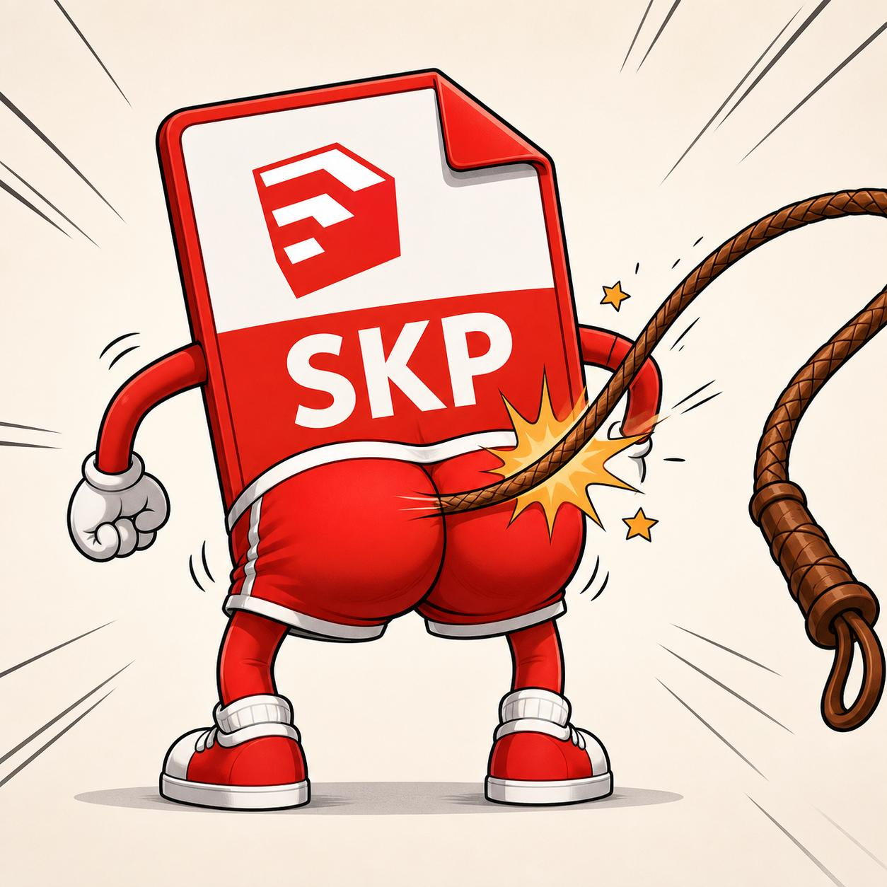

<div align="center">



# ата·та sketchup

**Веб-сервис, который находит проблемы в файлах SketchUp и даёт выбрать, что чинить.**

Загружаешь `.skp` — получаешь список провинностей с оценкой вреда.
Отмечаешь галочками, что исправить. Оригинал не трогается, на выходе новый файл.

</div>

---

## Зачем

Рабочие `.skp` в интерьерном проектировании разрастаются до сотен мегабайт: импортированные
из 3D Warehouse модели тянут за собой чужие материалы, текстуры 4000×2250 под плинтус и
тысячи неочищенных определений компонентов. Файл открывается пять минут, вьюпорт тормозит,
а найти концы вручную невозможно.

Сервис вскрывает файл, измеряет всё измеримое и показывает, из чего складывается вес.

## Что находит сейчас

Замеры на реальном рабочем файле — интерьер кафе, SketchUp 2024, **348.6 МБ**:

| Находка | Что нашлось |
|---|---|
| Вес геометрии | `model.dat` — **986 МБ** в несжатом виде, 63% веса файла |
| Материалы | **1377** штук, из них 1032 — просто цвет без текстуры |
| Клоны материалов | **79 семейств**, 512 лишних: `147× "_"`, `51× "_auto_"`, `18× "Image"` |
| Переразмеренные текстуры | **36 штук на 81 МБ**, крупнейшая 4000×2250 (9.85 МБ) |
| Визуальные дубли текстур | **11 групп** — одна картинка, пересохранённая по-разному |
| Побайтовые дубли | 6 групп |
| Не степень двойки | 275 из 345 текстур |
| Тяжёлые PNG без альфы | 12 штук, ≈11.7 МБ можно вернуть переводом в JPEG |
| Утечка метаданных | сохранён путь `\\<шара>\...\<имя сотрудника>\...` |

### С подключённым SDK — то, что лежит в `model.dat`

| Находка | Что нашлось |
|---|---|
| Геометрия сцены | **4 545 548 граней**, 9 728 801 ребро (с раскрытием компонентов) |
| Определения компонентов | 3820, из них **2754 не используются** — 72% мусора |
| Самый тяжёлый компонент | `HD_Rolo_Box_Blackout_Beige` — 1 175 106 граней, 6 вставок |
| Рекордсмен по вставкам | `HunterDouglas_Esfera Cordao` — 2226 вставок по 512 граней |
| Вложенность | 11 уровней |
| Висячие рёбра в корне | 3457 |
| Слои/теги | 147 |

Разбор занял **24 с**, пик памяти **4.5 ГБ** на файле 348 МБ.

Всего **19 находок**. Контейнерный слой — 2.5 с и 552 МБ, SDK-слой — 24 с и 4.5 ГБ.

## Что уже чинит

`purge_unused` — удаление определений компонентов, не вставленных в модель.
То же, что штатный Purge Unused, которого в этом файле никто ни разу не нажимал.

```
было        : 348.6 МБ
стало       : 244.0 МБ   (-104.7 МБ, 30%)
model.dat   : 986 -> 508 МБ
определений : 3820 -> 1573 (снято 2247 за 10 проходов)
```

Геометрия сцены не пострадала: те же 4 545 548 граней, 6 сцен, 147 тегов,
1211 материалов. Результат открывается читателем SketchUp — проверено.

> **Контейнер напрямую не правится, и это принципиально.** Пересборка ZIP делает
> файл нечитаемым для SketchUp, даже если не менять в нём ни байта содержимого.
> Проверено на рабочем файле: все 2340 записей совпадают по именам, размерам, CRC
> и способу сжатия, префикс идентичен — SketchUp не открывает. Причина в том, что
> `zipfile` пережимает `model.dat` своим уровнем, размер сжатых данных меняется,
> и смещения всех последующих записей уезжают.
>
> Поэтому любые правки идут только через `SUModelSaveToFile`, то есть родным
> сериализатором SketchUp. Оптимизация текстур по этой причине снята и будет
> переделана через SDK — находки по текстурам в отчёте остаются.

Каждый результат проверяется дважды: целостность контейнера и — главное —
открывается ли файл настоящим читателем SketchUp. Не прошедший проверку файл
скачать нельзя.

## Как это устроено

Начиная с SketchUp 2021 `.skp` — это ZIP-архив с 69-байтным бинарным заголовком спереди:

```
ff fe ff 0e "SketchUp Model"   ← UTF-16LE, длина в символах
ff fe ff 0a "{24.0.484}"
"VFF" + 10 байт служебных
PK\x03\x04 ...                 ← дальше обычный ZIP
```

Смещения в центральном каталоге записаны **абсолютно**, с учётом префикса. Благодаря этому
архив пересобирается штатным `zipfile`: пишем префикс, отдаём тот же файловый объект — и
соглашение о смещениях совпадает с исходным.

Внутри архива:

| Запись | Что там |
|---|---|
| `model.dat` | вся геометрия, компоненты, слои, сцены — проприетарный бинарь |
| `materials/<имя>/` | `material.xml` + текстуры + превью |
| `meta/meta.dat` | версия, единицы, GUID, путь последнего сохранения — простой TLV |
| `thumbnails/`, `styles/`, `scene_thumbnails/` | превью и стили |

Отсюда два слоя анализа:

- **Слой контейнера** — работает сейчас, чистый Python, без внешних зависимостей кроме Pillow.
- **Слой модели** — разбор `model.dat` через [SketchUp C SDK](https://developer.sketchup.com/).
  Даёт полигонаж, тяжёлые компоненты, неиспользуемые определения, вложенность.
  Подключается опционально, см. ниже.

## Слой геометрии: SketchUp SDK

**SDK существует только под Windows x64 и macOS.** Сборки под Linux у Trimble нет —
в архиве лежат `SketchUpAPI.dll` / `.framework` и ни одного `.so`.

Это решается Wine. Обвязка — чистый `ctypes`, ей не нужен ни компилятор, ни
сторонние пакеты, поэтому под Wine хватает embeddable-сборки Windows-питона
на 11 МБ. Всё уже собрано в образе, отдельная Windows-машина не нужна.

Сверено на файле 348 МБ — результат под Wine совпадает с нативным прогоном
до единицы:

| | Нативно Windows | Wine в контейнере |
|---|---|---|
| Граней | 4 545 548 | 4 545 548 |
| Рёбер | 9 728 801 | 9 728 801 |
| Определений / неиспользуемых | 3820 / 2754 | 3820 / 2754 |
| Время разбора | 24 с | 45 с |
| Пик памяти | 4.5 ГБ | 4.65 ГБ |

Полный цикл через веб-морду — загрузка, контейнерный слой, геометрия, правила —
занимает **53 с** и даёт 19 находок.

SDK **не входит в репозиторий и в образ** — это несколько десятков мегабайт чужих
бинарников. Положите его рядом сами:

1. Возьмите Desktop SDK версии не ниже той, в которой сохранены ваши файлы
   (для файлов SketchUp 2024 — SDK 2024+, более старый их не откроет).
2. Распакуйте архив.
3. Укажите путь к нему в `.env` рядом с `docker-compose.yml`:

```bash
echo 'ATATA_SDK_HOST_PATH=/path/to/SDK_WIN_x64_2024-1' > .env
docker compose up -d --build
```

Без Docker (нативно на Windows или macOS):

```bash
export ATATA_SDK_PATH=/path/to/SDK_WIN_x64_2024-1
python -m atata.cli model.skp
```

Проверить, подхватился ли SDK:

```bash
curl -s localhost:8080/health | python -m json.tool
```

Поле `sdk.mode` покажет режим (`native` / `wine` / `disabled`), `sdk.reason` —
причину отказа, если слой выключен.

Сверить обвязку с заголовками вашей версии SDK:

```bash
python tools/verify_sdk_signatures.py
```

## Запуск

```bash
docker compose up -d --build
```

Морда на `http://localhost:8080`.

Без Docker:

```bash
python -m venv .venv && . .venv/bin/activate
pip install -r requirements.txt
uvicorn atata.main:app --reload
```

Консольный прогон, без веба:

```bash
python -m atata.cli model.skp
python -m atata.cli model.skp --fix downscale_textures -o clean.skp
```

## Требования к железу

Замерено на файле 348 МБ: пик 552 МБ на анализе, 902 МБ на анализе с пересборкой.
`model.dat` в несжатом виде — примерно **2.8× от веса файла**.

SDK-слой замерен на том же файле: **4.5 ГБ пика** и 24 с. Память растёт быстрее
размера файла — модель разворачивается в объектный граф.

| | Слой контейнера | Слой модели (SDK) |
|---|---|---|
| RAM | 4 ГБ | 8 ГБ на файл 350 МБ, **16 ГБ** на 600 МБ |
| vCPU | 2 | 4 |
| Диск | 40 ГБ | 100 ГБ |

Требования по памяти умножаются на число **одновременных** задач: `ATATA_MAX_WORKERS`
на SDK-этапе должен быть `1`.

## Настройки

| Переменная | По умолчанию | Что делает |
|---|---|---|
| `ATATA_DATA_DIR` | `./data` | где лежат загруженные и собранные файлы |
| `ATATA_MAX_UPLOAD_MB` | `1024` | предел размера загрузки |
| `ATATA_MAX_WORKERS` | `2` | сколько тяжёлых задач одновременно |
| `ATATA_JOB_TTL_HOURS` | `6` | через сколько часов чистить файлы задачи |
| `ATATA_SDK_PATH` | — | путь к распакованному SketchUp SDK (Windows/macOS) |

## Ограничения

- Только новый формат, **SketchUp 2021+**. Файлы старше — сплошной проприетарный бинарь,
  без SDK не читаются вообще.
- Слой геометрии требует SDK. Без него сервис работает, но всё про `model.dat`
  показывает косвенной оценкой и честно это пишет.
- Под Wine разбор примерно в 1.8 раза медленнее нативного.
- Перцептивный хеш даёт ложные срабатывания на однотонных и мелкоузорчатых текстурах —
  списки визуальных дублей нужно смотреть глазами.

## Дальше

- [x] Обвязка SketchUp C SDK через `ctypes`
- [x] Правила по геометрии: полигонаж с раскрытием компонентов, тяжёлые определения,
      неиспользуемые определения, вложенность, висячие рёбра
- [x] Прогнать обвязку на настоящем SDK (сигнатуры сверены с заголовками,
      расхождений нет; `tools/verify_sdk_signatures.py`)
- [x] Запустить SDK в Linux-контейнере через Wine
- [x] Purge неиспользуемого через SDK
- [x] Проверка результата настоящим читателем SketchUp
- [ ] Оптимизация текстур через SDK (взамен снятой контейнерной)
- [ ] Слияние материалов-клонов
- [ ] Параллельный замер текстур по ядрам

## Лицензия

MIT — см. [LICENSE](LICENSE).
